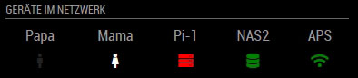

# MMM-MacAddressScan
A module for MagicMirror which determines the status of devices on the
network based on their MAC address. It can also look up devices by
IP addresses or hostnames.

This module is an enhanced clone of the excellent MMM-NetworkScanner
module by Ian Perrin (http://ianperrin.com).

## Table of contents

1. [Technical Overview](#technical-overview)
1. [Installation](#installation)
1. [Configuration](#configuration)
    1. [Device Object](#device-object)
        1. [Generating the device array](#generating-the-device-array)
    1. [Examples](#examples)
        1. [Simple example](#simple-example)
        1. [Example with columns](#example-with-columns)
        1. [Keep alive example](#keep-alive-example)
        1. [Notification example](#notification-example)
    1. [CSS Styling](css-styling)
1. [Updating](#updating)
1. [Screenshots](#screenshots)
1. [Support](#support)
1. [License](#license)

## Technical Overview

The scan of the local area network is performed by the `arp-scan` tool
which uses the the Address Resolution Protocol (ARP). ARP is a communication
protocol used for discovering the link layer address, such as a MAC address,
associated with a given internet layer address, typically an IPv4 address.
This mapping is a critical function in the Internet protocol suite. ARP was
defined in 1982 by RFC 826, which is Internet Standard STD 37.

This module uses ARP packets to discover all active devices in a LAN even if
protected by a firewall designed to hide the presence of the device. Whether
you are using ethernet or WiFi, the IPv4 devices on your LAN must respond to
ARP or they cannot communicate. Since ARP is non-routable, this type of scanner
only works on the local LAN (local subnet or network segment).

Devices cannot hide from ARP packets like they can hide from Ping.

## Installation

In your terminal, install `arp-scan`:
````bash
cd ~/
sudo apt-get install arp-scan   
````

*Optionally*, update the vendor database used by `arp-scan`:
````bash
cd /usr/share/arp-scan
sudo get-iab -v -u http://standards-oui.ieee.org/iab/iab.txt
sudo get-oui -v -u http://standards-oui.ieee.org/oui/oui.txt
````

Clone this repository into the MagicMirror Modules folder:
````bash
cd ~/MagicMirror/modules
git clone https://gitlab.com/doctorfree/MMM-MacAddressScan.git
````

Install the dependencies (`sudo`, `ping`) in the MMM-MacAddressScan module folder:
````
cd ~/MagicMirror/modules/MMM-MacAddressScan
npm install
````

Add the module to the modules array in the `config/config.js` file:
````javascript
    {
        module: 'MMM-MacAddressScan',
        position: 'top_left', 
        config: {
            // Optional config options
        }        
    },
````

## Configuration

| **Option** | **Default** | **Description** |
| --- | --- | --- |
| `devices` | [] | an array of devices to be found on the network. See [Device object](#device-object) |
| `network` | `-l` | `optional` a network mask to limit the scope of the network scan, i.e. `192.168.0.0/24`. If omitted, or set to `-l`, the entire network will be scanned. |
| `showIP` | true | `optional` shows the IP address of devices found on the network |
| `showUnknown` | true | `optional` shows devices found on the network even if not specified in the `devices` option |
| `showOffline` | true | `optional` shows devices specified in the `devices` option even when offline |
| `showLastSeen` | false | `optional` shows when the device was last seen e.g. "Device Name - last seen 5 minutes ago" |
| `keepAlive` | 180 | `optional` how long (in seconds) a device should be considered 'alive' since it was last found on the network |
| `updateInterval` | 20 | `optional` how often (in seconds) the module should scan the network |
| `sort` | `true` | `optional` sorts the devices in alphabetical order when shown in the mirror |
| `residents` | [] | `optional` an array of names of the devices that should be monitored if they are online |
| `occupiedCMD` | `{}` | `optional` the notification to be sent if one of the devices in the `residents` array is found online. See [Notification Example](#notification-example). |
| `vacantCMD` | `{}` | `optional` the notification to be sent if **NONE** of the devices in the `residents` array is found online. See [Notification Example](#notification-example). |
| `debug` | `false` | `optional` adds extended messages to the log. |
| `colored` | `false` | `optional` determines whether devices are shown in the color defined in the devices section. |
| `coloredSymbolOnly` | `false` | `optional` shows only the devices symbol. |
| `showLastSeenWhenOffline:` | `false` | `optional` show last seen only when offline. |
| `showDeviceColums:` | `false` | `optional` show devices as columns. |
| `coloredState:` | `false` | `optional` determines whether devices are shown in a color defined in the devices section and controlled by the online / offline state. |


### Device Object
The device object contains information about the devices to be found on the network.

| **Key** | **Description** | **Example** |
| --- | --- | --- |
| `macAddress` | `optional` the MAC address of the device. | `aa:bb:cc:11:22:33` |
| `ipAddress` | `optional` the IP address **or** host name of the device. | `192.168.0.1` or `gitlab.com` |
| `name` | `optional` the friendly name for the device. If omitted, the `macAddress` or `ipAddress` will be used. | `Phone` or `Router` |
| `icon` | `optional` the symbol to show next to the device. See [Font Awesome](http://fontawesome.io/cheatsheet/) cheatsheet. If omitted, `question` will be used. | There are a huge number of icons to choose from. Here are some examples: `globe`, `server`, `desktop`, `laptop`, `mobile`, `wifi`. |
| `color` | `optional` the color the device should be display with. | `#ff0000`  for red |
| `colorStateOnline` | `optional` the color the device should be display with when it is online. | `#ff0000`  for red |
| `colorStateOffline` | `optional` the color the device should be display with when it is offline. | `#ff0000`  for red |
| `showInNewRow` | `optional` add a line break if showDeviceColumns = true. | false  for no line break |

**Note:** A device object should only contain either a `macAddress` *or*
an `ipAddress` **NOT** both.

**Note:** MAC and Static IP addresses work more consistently than DHCP
assigned addresses or hostnames.

**Note:** The `coloredState` parameter overwrites the `colored` parameter if
both parameters are set to true. With the parameter `coloredSymbolOnly` the
status driven coloring can be limited to the icon. 

#### Generating the device array
The `devices` array can be generated by using `arps2mm.sh` from within the
`scripts` folder. The output of the script will include all the devices
found on the network, using the name of the vendor identified from the
arp-scan result. Run the following script, edit the device names and icons
then copy the array into the config file:

````bash
cd ~/MagicMirror/modules/MMM-MacAddressScan/scripts
chmod +x arps2mm.sh
./arps2mm.sh
````

**Note:** Updating the vendor database is recommended before generating the
device array. See the [installation instructions](#installation) for details.

### Examples

#### Simple example
Scans the network (using the default `updateInterval`) and display the status
of the four specified devices. Display the IP of discovered devices as well:
````javascript
    {
        module: "MMM-MacAddressScan",
        position: "top_left",
        header: "Who's home",
        config: {
            devices: [
                { macAddress: "1a:1b:1c:1a:1b:1c", name: "Dad", icon: "male"},
                { macAddress: "2a:2b:2c:2a:2b:2c", name: "Mum", icon: "female"},
                { macAddress: "3a:3b:3c:3a:3b:3c", name: "Son", icon: "male"},
                { macAddress: "4a:4b:4c:4a:4b:4c", name: "Daughter", icon: "female"}
            ],
            showIP: true,
            showUnknown: false,
        }
     }
````
#### Example with columns
Displays the specified devices as columns:
````javascript
    {
        module: "MMM-MacAddressScan",
        position: "top_left",
        header: "Geräte im Netzwerk",
        config: {
            devices: [
                { 
                    ipAddress: "192.168.178.101", 
                    name: "UniFi", 
                    icon: "server", 
                    colorStateOnline: "green", 
                    colorStateOffline: "red",
                },
                { 
                    ipAddress: "192.168.178.31", 
                    name: "QNAP1", 
                    icon: "database", 
                    colorStateOnline: "green", 
                    colorStateOffline: "red",
                 },
                { 
                    ipAddress: "192.168.178.32", 
                    name: "QNAP2", 
                    icon: "database", 
                    colorStateOnline: "green", 
                    colorStateOffline: "red",
                    showInNewRow: true,
                },
                { 
                    ipAddress: "192.168.178.33", 
                    name: "QNAP3", 
                    icon: "database", 
                    colorStateOnline: "green", 
                    colorStateOffline: "red",
                },
                { 
                    ipAddress: "192.168.178.134", 
                    name: "APS", 
                    icon: "wifi", 
                    colorStateOnline: "green", 
                    colorStateOffline: "red",
                 },

            ],
            sort: false,
            showIP: false,
            showUnknown: false,
            showDeviceColums: true,
            coloredState: true,
        }
    }
````
#### Keep alive example
Scan every 5 seconds and only display the specified devices whether they are
online or offline. Devices will continue to be shown as online
(i.e. kept alive) for 5 mins after they are last found:
````javascript
    {
        module: 'MMM-MacAddressScan',
        position: 'top_left', 
        config: {
            devices: [
                    { ipAddress: "gitlab.com", name: "Gitlab", icon: "globe"},
                    { macAddress: "1a:1b:1c:1a:1b:1c", name: "Server", icon: "server"},
                    { macAddress: "2a:2b:2c:2a:2b:2c", name: "Desktop", icon: "desktop"},
                    { ipAddress: "10.1.1.10", name: "Laptop", icon: "laptop"},
                    { macAddress: "4a:4b:4c:4a:4b:4c", name: "Mobile", icon: "mobile"},
                ],
            showIP: false,
            showUnknown: false,
            showOffline: true,
            keepAlive: 300,
            updateInterval: 5
        }        
    },
````

#### Notification example
As with the previous example, this scans every 5 seconds and only display
the specified devices whether they are online or offline. Devices will
continue to be shown as online (i.e. kept alive) for 5 mins after they
are last found on the network.

In addition, the module will send a notification (`occupiedCMD`) to turn
the monitor on when either `Mobile` or `Laptop` (the `residents`) are found
on the network. Another notification (`vacantCMD`) will be sent when neither
device is online:
````javascript
    {
        module: 'MMM-MacAddressScan',
        position: 'top_left', 
        config: {
            devices: [
                    { ipAddress: "gitlab.com", name: "Gitlab", icon: "globe"},
                    { macAddress: "1a:1b:1c:1a:1b:1c", name: "Server", icon: "server"},
                    { macAddress: "2a:2b:2c:2a:2b:2c", name: "Desktop", icon: "desktop"},
                    { ipAddress: "10.1.1.10", name: "Laptop", icon: "laptop"},
                    { macAddress: "4a:4b:4c:4a:4b:4c", name: "Mobile", icon: "mobile"},
                ],
            showUnknown: false,
            showOffline: true,
            keepAlive: 300,
            updateInterval: 5,
            residents: ["Mobile", "Laptop"],
            occupiedCMD: {notification: 'REMOTE_ACTION', payload: {action: 'MONITORON'}},
            vacantCMD  : {notification: 'REMOTE_ACTION', payload: {action: 'MONITOROFF'}},

        }        
    },
````
**NOTE** The `REMOTE_ACTION` notifications (`MONITORON` and `MONITOROFF`) actions
require the [MMM-Remote-Control](https://github.com/Jopyth/MMM-Remote-Control)
module to be installed.

## CSS Styling

The default styling applied to the MMM-MacAddressScan module is as follows:

```css
.MMM-MacAddressScan .device {
  text-align: left;
}

.MMM-MacAddressScan .device i {
  padding-left: 0;
  padding-right: 10px;
}

.MMM-MacAddressScan .date {
  padding-left: 30px;
  text-align: right;
}
```

Additional custom styling may be applied with entries in:

```sh
MagicMirror/css/custom.css
```

For example, to increase the font size of devices text labels,
add the following to your custom.css file:

```css
.MMM-MacAddressScan .headerDevCell {
  font-size: 28px;
}
```

## Updating

To update the module to the latest version, use your terminal to go to your
MMM-MacAddressScan module folder and type the following command:

````
cd ~/MagicMirror/modules/MMM-MacAddressScan
git pull
npm install
```` 

If you haven't changed the modules, this should work without any problems. 
Type `git status` to see your changes, if there are any, you can reset them
with `git reset --hard`. After that, git pull should be possible.

## Screenshots

<p float="left">
Devices as rows<br/>
  
</p>
<p float="left">
Devices as columns<br/>
  
</p>
<p float="left">
Devices as columns with newLines<br/>
  
</p>
<p float="left">
Network/System Info<br/>(click to enlarge)<br/>
  
</p>
The Network/System Info screenshot is from a MagicMirror configured with
the following modules:

- MMM-Remote-Control
- MMM-Tools
- mmm-hue-lights
- MMM-Solar
- internet-monitor
- MMM-MacAddressScan

## Support

Issues with MMM-MacAddressScan can be reported and tracked in the Issues section
of the repository at https://gitlab.com/doctorfree/MMM-MacAddressScan/-/issues

## License

Copyright (c) 2016 Ian Perrin

Copyright (c) 2021 Ronald Joe Record

MIT License
